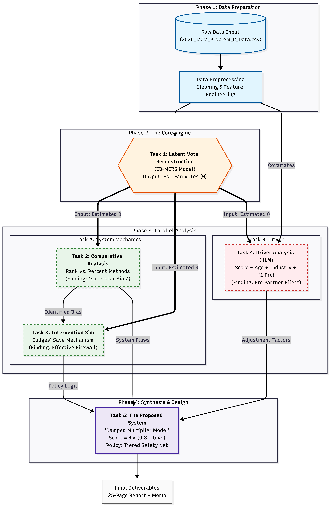
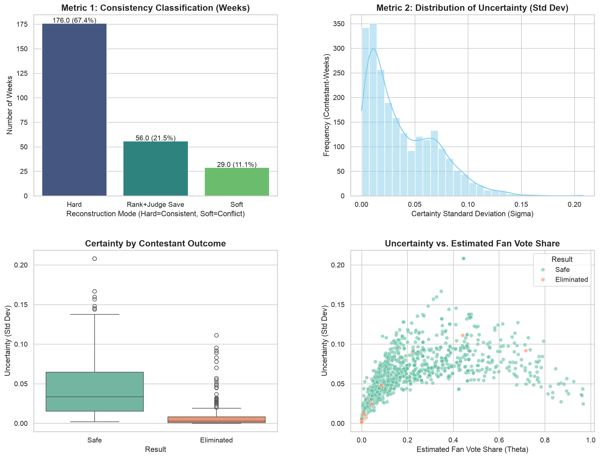

# Dancing with Algorithms: Hidden Vote Reconstruction and Scoring-System Design

This repository contains the modeling code, processed data, selected results, and final report for **Problem C of the 2026 Mathematical Contest in Modeling (MCM)**. The project studies how undisclosed fan votes and judges' scores interact in *Dancing with the Stars* and how alternative aggregation rules affect elimination outcomes.

## Research questions

1. Can latent fan-vote shares be reconstructed from judges' scores and historical eliminations?
2. How do rank-based and percentage-based scoring rules change outcomes?
3. Do judges and fans respond differently to contestant characteristics?
4. Can a transparent alternative scoring rule reduce the influence of extreme popularity?

## Methods

- **Constrained Monte Carlo inference:** judge-informed Dirichlet priors with adaptive hard/soft acceptance criteria.
- **Counterfactual simulation:** paired comparison of rank and percentage aggregation using the same reconstructed votes.
- **Hierarchical statistical modeling:** dual-response linear mixed-effects models with season and professional-partner effects, followed by Wald tests.
- **Mechanism design:** a bounded damped-multiplier rule that couples technical performance and audience support.

## Dataset and verified outputs

- 34 seasons and 4,631 contestant-week panel records.
- 261 elimination weeks and 2,251 reconstructed contestant-week vote records.
- Reconstruction modes: 176 hard-acceptance weeks, 29 soft-acceptance weeks, and 56 judge-save weeks.
- In the fitted preference models, none of the tested judge-versus-fan coefficient differences reached the 0.05 significance level.

The repository reports figures and counts recalculated from the included CSV files. Monte Carlo estimates can vary slightly across runs; the reconstruction script fixes NumPy's random seed for reproducibility.

**Final report:** [PDF](paper/final_report.pdf) | [DOCX](paper/final_report.docx)

## Repository structure

```text
.
├── data/
│   ├── raw/          # Official competition data used by the driver analysis
│   ├── processed/    # Season-week-contestant panel
│   └── results/      # Reconstructed votes and model summaries
├── figures/          # Selected workflow and result figures
├── paper/            # Final competition report
└── src/              # Reproducible analysis scripts
```

## Reproduce the analysis

```bash
python -m venv .venv
source .venv/bin/activate
pip install -r requirements.txt

python src/reconstruct_votes.py
python src/compare_scoring_rules.py
python src/analyze_controversial_cases.py
python src/analyze_preference_drivers.py
python src/visualize_reconstruction.py
```

The reconstruction step is simulation-intensive because it evaluates tens of thousands of candidate vote vectors for each elimination week. The checked-in result files allow the downstream analyses to be run independently.

## Key figures





## 中文简介

本项目针对 2026 年美国大学生数学建模竞赛 C 题，研究《Dancing with the Stars》中未公开观众投票的反演以及评分机制优化。项目使用基于 Dirichlet 先验的约束蒙特卡洛采样估计隐性观众票，利用反事实模拟比较排名法与百分比法，并通过双响应分层线性混合效应模型分析评委与观众的偏好差异。在此基础上，项目提出具有有界动态权重的阻尼乘数模型，以限制极端人气对淘汰结果的过度影响。

## Notes

- The original problem PDFs, temporary drafts, IDE settings, and LaTeX build artifacts are intentionally excluded.
- The final report is included for research context; the source code and CSV outputs are the reproducible artifacts.
